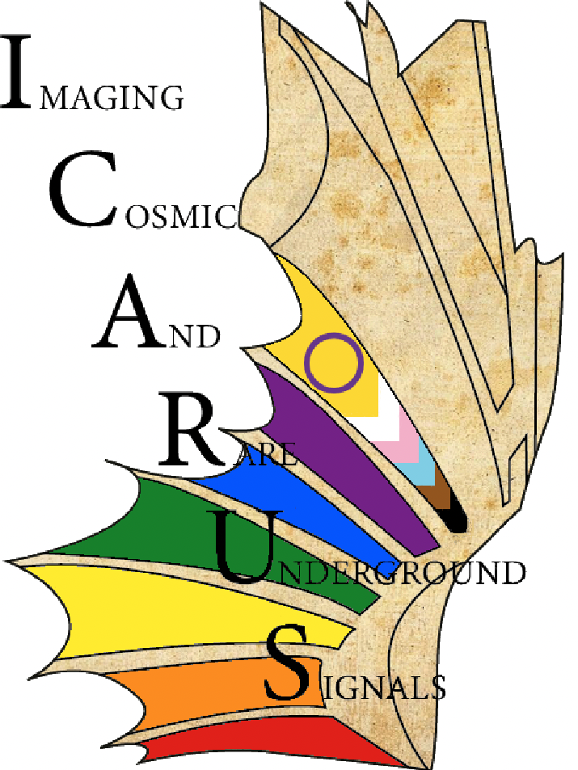

# Organizational Documents for ICARUS
* ICARUS Bylaws: [https://sbn-docdb.fnal.gov/cgi-bin/sso/ShowDocument?docid=18434](SBN-Doc-18434)
* ICARUS Institutions, members, and Institutional Board (IB) representatives: [https://icarus.fnal.gov/collaboration/](https://icarus.fnal.gov/collaboration/)
* ICARUS Editorial and Speakers Board (ESB): [https://sbn-docdb.fnal.gov/cgi-bin/sso/ShowDocument?docid=17328](SBN-Doc-17328)
* ICARUS Analysis Blinding Policy: [https://sbn-docdb.fnal.gov/cgi-bin/sso/ShowDocument?docid=34523](SBN-Doc-34523)
* ICARUS Shift Policy: [https://sbn-docdb.fnal.gov/cgi-bin/sso/ShowDocument?docid=23913](SBN-Doc-23913)

## ICARUS Organizational Charts ##
* Analysis and Software: [https://sbn-docdb.fnal.gov/cgi-bin/sso/ShowDocument?docid=38529](SBN-Doc-38529)

## Repository for ICARUS Technical Notes
* ICARUS Technical Notes have been consolidated at the following location: [https://icarus-exp.fnal.gov/at_work/technical_notes.html](https://icarus-exp.fnal.gov/at_work/technical_notes.html)
* The username and password required to access that repository are on the ICARUS ECL under "projects," labeled "Icarus Website Internal pages (password protected) username/password"

## Publicly Approved Plots ##

## ICARUS Logos ##

