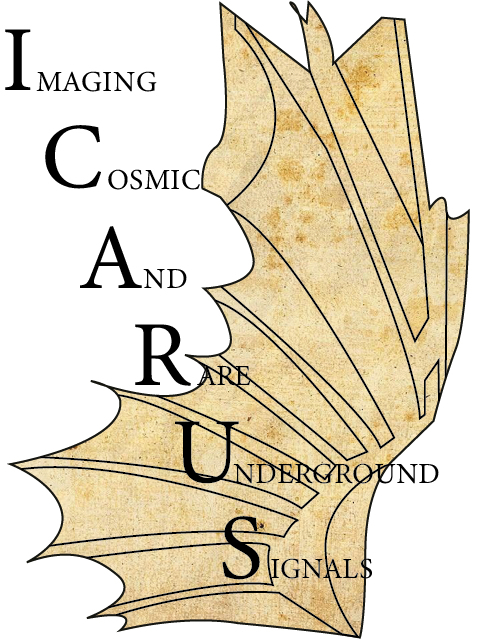
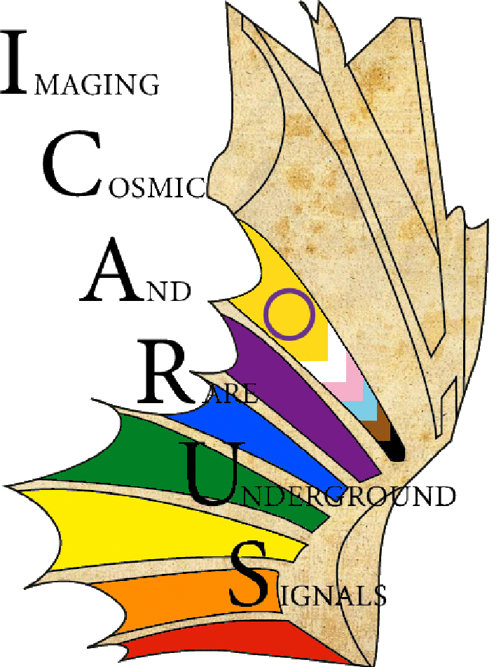

# Organizational Documents for ICARUS
* ICARUS Bylaws: [SBN-Doc-18434](https://sbn-docdb.fnal.gov/cgi-bin/sso/ShowDocument?docid=18434)
* ICARUS Institutions, members, and Institutional Board (IB) representatives: [https://icarus.fnal.gov/collaboration/](https://icarus.fnal.gov/collaboration/)
* ICARUS Editorial and Speakers Board (ESB): [SBN-Doc-17328](https://sbn-docdb.fnal.gov/cgi-bin/sso/ShowDocument?docid=17328)
* ICARUS Analysis Blinding Policy: [SBN-Doc-34523](https://sbn-docdb.fnal.gov/cgi-bin/sso/ShowDocument?docid=34523)
* ICARUS Expert Shift Policy: [SBN-Doc-23913](https://sbn-docdb.fnal.gov/cgi-bin/sso/ShowDocument?docid=23913)

## ICARUS Organizational Charts ##
* Analysis and Software: [SBN-Doc-38529](https://sbn-docdb.fnal.gov/cgi-bin/sso/ShowDocument?docid=38529)

## ICARUS Working Group Descriptions ##
* The username and password required to access these pages are on the ICARUS ECL under the "projects" tab in the field labeled "Icarus Website Internal pages (password protected) username/password."
* Information on the working groups within ICARUS and contact information for the working group conveners can be found at [https://icarus-exp.fnal.gov/at_work/wg.html](https://icarus-exp.fnal.gov/at_work/wg.html).
* A calendar of regular working group meetings can be found at [https://icarus-exp.fnal.gov/at_work/meetings_b.html](https://icarus-exp.fnal.gov/at_work/meetings_b.html).

## Repository for ICARUS Technical Notes
* The username and password required to access this page are on the ICARUS ECL under the "projects" tab in the field labeled "Icarus Website Internal pages (password protected) username/password."
* ICARUS Technical Notes have been consolidated at the following location: [https://icarus-exp.fnal.gov/at_work/technical_notes.html](https://icarus-exp.fnal.gov/at_work/technical_notes.html)

## Publicly Approved Plots ##

## ICARUS Logos ##

