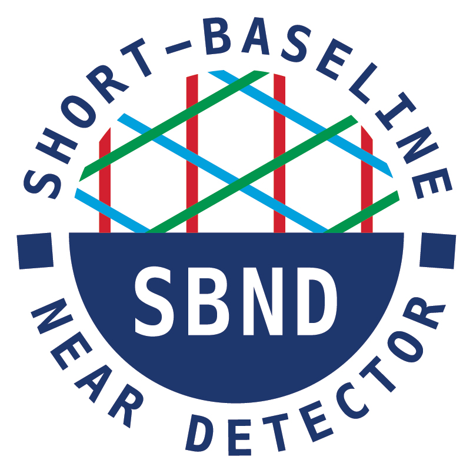
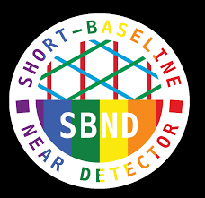

# SBND Website
* Fermilab website: [https://sbn-nd.fnal.gov/index.html](https://sbn-nd.fnal.gov/index.html)

# Organizational Documents for SBND
* SBND Bylaws: [https://sbn-docdb.fnal.gov/cgi-bin/sso/ShowDocument?docid=1](https://sbn-docdb.fnal.gov/cgi-bin/sso/ShowDocument?docid=1)
* SBND Speakers Committee Procedures: [https://sbn-docdb.fnal.gov/cgi-bin/sso/ShowDocument?docid=451](https://sbn-docdb.fnal.gov/cgi-bin/sso/ShowDocument?docid=451)
* SBND Community Agreement: [https://sbn-docdb.fnal.gov/cgi-bin/sso/ShowDocument?docid=37912](https://sbn-docdb.fnal.gov/cgi-bin/sso/ShowDocument?docid=37912)
* SBN Young Bylaws: [https://sbn-docdb.fnal.gov/cgi-bin/sso/ShowDocument?docid=22076](https://sbn-docdb.fnal.gov/cgi-bin/sso/ShowDocument?docid=22076)

## SBND Organizational Chart ##
* As of May 2025: [https://sbn-docdb.fnal.gov/cgi-bin/sso/ShowDocument?docid=41097](https://sbn-docdb.fnal.gov/cgi-bin/sso/ShowDocument?docid=41097)

## Publicly Approved Plots ##
* For a list of publicly approved plots, see SBN DocDB entries with topic "Approved for External Use": [https://sbn-docdb.fnal.gov/cgi-bin/sso/ListBy?topicid=437](https://sbn-docdb.fnal.gov/cgi-bin/sso/ListBy?topicid=437)

## SBND Logos ##
* Standard Logo [https://sbn-docdb.fnal.gov/cgi-bin/sso/ShowDocument?docid=573](https://sbn-docdb.fnal.gov/cgi-bin/sso/ShowDocument?docid=573)
* Pride Logo [https://sbn-docdb.fnal.gov/cgi-bin/sso/ShowDocument?docid=18259](https://sbn-docdb.fnal.gov/cgi-bin/sso/ShowDocument?docid=18259)

