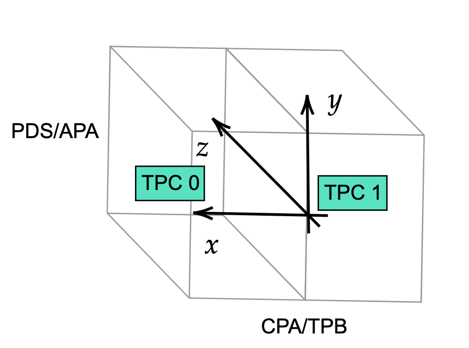

# Viewing charged particles in SBND using a particle gun generator and analyzer module
(Requires some knowledge of reconstruction chains, `c++`, `python` and a recent version of `sbndcode`. I ran on v09\_43_00)<br/><br/>If you still need to setup your `sbndcode` area, follow steps 1-3 on the [SBND Commissioning Page - Get Started Guide](https://sbnsoftware.github.io/sbndcode_wiki/commissioning/SBND_Commissioning_Get_Started.html)
1 - Visual Studio Code
----------------------
Although there are many text editor options, I'd recommend [Visual Studio Code](https://code.visualstudio.com/) for many reasons: <br/><br/>
1. It has syntax highlighting for almost every language including `Fermilab Hierarchical Configuration Language` or `.fcl` files.<br/>
2. You can view `.root` files using the `Explorer` page.<br/>
3. It supports `ssh` connections with `X11 forwarding`.<br/>
4. There are many keyboard shortcuts such as multiline commenting and search and replace. <br/>

To get started, let's first [add an ssh host on VSCode](https://code.visualstudio.com/docs/remote/ssh). Whichever `gpvm` machine you use should be fine. Next, we should [add extensions](https://code.visualstudio.com/docs/editor/extension-marketplace). For this tutorial, you'll need the following extensions: <br/><br/>
-[Fermilab Hierarchical Configuration Language support](https://marketplace.visualstudio.com/items?itemName=robertosoleti.fcl)<br/>
-[Python](https://marketplace.visualstudio.com/items?itemName=ms-python.python) and if you use [Jupyter Notebooks](https://marketplace.visualstudio.com/items?itemName=ms-toolsai.jupyter)<br/> 
-[C/C++](https://marketplace.visualstudio.com/items?itemName=ms-vscode.cpptools) <br/>
-[Root File Viewer](https://marketplace.visualstudio.com/items?itemName=albertopdrf.root-file-viewer) <br/><br/>
Now we can get started on doing physics in SBND! First, open the terminal in VSCode to make a directory and your `.fcl` file:
```
mkdir /sbnd/app/users/$USER/tutorial
mkdir /sbnd/app/users/$USER/tutorial/data 
cd /sbnd/app/users/$USER/tutorial/data
touch muon_gun.fcl
```
We will edit this `.fcl` file in the next section. 

2 - Particle Gun
-----------------------------------------------------------------------------
Using a particle gun is a simple way to simulate a single particle, or multiple particles at a time in the SBND detector (This can be done in ICARUS as well but I've done it here in SBND). Let's look at a particle gun `.fcl` file and see what's going on! Add the following lines to the file `muon_gun.fcl`

```bash
#include "prodsingle_sbnd_proj.fcl" #Include .fcl for producing particles

physics.producers.generator.PadOutVectors: true  #Duplicates single element vectors to match length of longest vector
physics.producers.generator.PDG: [13]            #Generate 1 muon
physics.producers.generator.P0: [3]              #p = 3 GeV/c 
physics.producers.generator.SigmaP: [0]          #No variance
physics.producers.generator.SigmaX: [0]          #
physics.producers.generator.SigmaY: [0]          #    
physics.producers.generator.SigmaZ: [0]          #    
physics.producers.generator.PosDist: 0           #0:Uniform 1:Gaussian         
physics.producers.generator.X0: [-150]           #Start track in TPC0 (x<0)
physics.producers.generator.Y0: [-100]           #Start in lower half of detector
physics.producers.generator.Z0: [-50]            #Start 50 cm upstream
physics.producers.generator.Theta0XZ: [25]       #Muon trajectory in X-Z plane
physics.producers.generator.Theta0YZ: [30]       #Muon trajectory in Y-Z plane
physics.producers.generator.SigmaThetaXZ: [0]    #No variance
physics.producers.generator.SigmaThetaYZ: [0]    #
physics.producers.generator.AngleDist: 0         #0:Uniform 1:Gaussian
```
(More information on all the settable parameters can be found [here](https://cdcvs.fnal.gov/redmine/projects/larsoft/wiki/EventGenerator#SingleGen.))
</br></br>To get started using this particle gun, save the file and call 



