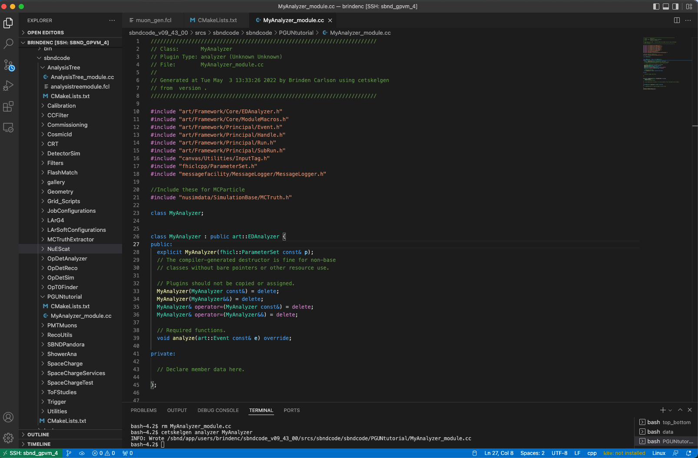
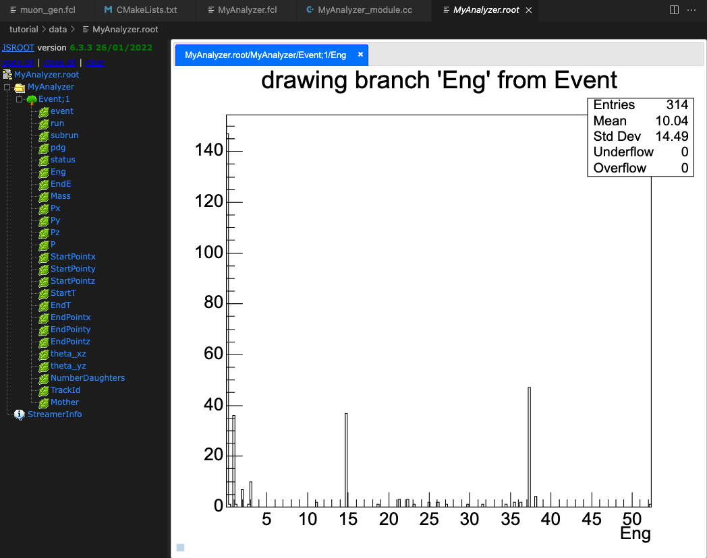

# Viewing charged particles in SBND using a particle gun generator and analyzer module

(Requires some knowledge of reconstruction chains, `c++`, `python` and a recent version of `sbndcode`. I ran on `v09\_43_00`)<br/><br/>If you still need to setup your `sbndcode` area, follow steps 1-3 on the [SBND Commissioning Page - Get Started Guide](https://sbnsoftware.github.io/sbndcode_wiki/commissioning/SBND_Commissioning_Get_Started.html)

1 - Visual Studio Code
----------------------
Although there are many text editor options, I'd recommend [Visual Studio Code](https://code.visualstudio.com/) for many reasons: <br/><br/>
1. It has syntax highlighting for almost every language including `Fermilab Hierarchical Configuration Language` or `.fcl` files.<br/>
2. You can view `.root` files using the Explorer page.<br/>
3. It supports ssh connections with X11 forwarding.<br/>
4. There are many keyboard shortcuts such as multiline commenting and search and replace. <br/>

To get started, let's first [add an ssh host on VSCode](https://code.visualstudio.com/docs/remote/ssh). Whichever gpvm machine you use should be fine. Next, we should [add extensions](https://code.visualstudio.com/docs/editor/extension-marketplace). For this tutorial, you'll need the following extensions: <br/><br/>
-[Fermilab Hierarchical Configuration Language support](https://marketplace.visualstudio.com/items?itemName=robertosoleti.fcl)<br/>
-[Python](https://marketplace.visualstudio.com/items?itemName=ms-python.python) and if you use [Jupyter Notebooks](https://marketplace.visualstudio.com/items?itemName=ms-toolsai.jupyter)<br/> 
-[C/C++](https://marketplace.visualstudio.com/items?itemName=ms-vscode.cpptools) <br/>
-[Root File Viewer](https://marketplace.visualstudio.com/items?itemName=albertopdrf.root-file-viewer) <br/><br/>
Now we can get started on doing physics in SBND! First, open the terminal in VSCode to make a directory and your `.fcl` file:
```
mkdir /sbnd/app/users/$USER/tutorial
mkdir /sbnd/app/users/$USER/tutorial/data 
cd /sbnd/app/users/$USER/tutorial/data
touch muon_gun.fcl
```
We will edit this `.fcl` file in the next section. 

2 - Particle Gun
-----------------------------------------------------------------------------
Using a particle gun is a simple way to simulate a single particle, or multiple particles at a time in the SBND detector (This can be done in ICARUS as well but I've done it here in SBND). Let's look at a particle gun `.fcl` file and see what's going on! Add the following lines to the file `muon_gun.fcl`

```bash
#Include .fcl for producing particles
#include "prodsingle_sbnd_proj.fcl" 

physics.producers.generator.PadOutVectors: true  #Duplicates single element vectors to match length of longest vector
physics.producers.generator.PDG: [13]            #Generate 1 muon
physics.producers.generator.P0: [3]              #p = 3 GeV/c 
physics.producers.generator.SigmaP: [0]          #No variance
physics.producers.generator.SigmaX: [0]          #
physics.producers.generator.SigmaY: [0]          #    
physics.producers.generator.SigmaZ: [0]          #    
physics.producers.generator.PosDist: 0           #0:Uniform 1:Gaussian         
physics.producers.generator.X0: [-150]           #Start track in TPC0 (x<0)
physics.producers.generator.Y0: [-100]           #Start in lower half of detector
physics.producers.generator.Z0: [-50]            #Start 50 cm upstream
physics.producers.generator.Theta0XZ: [25]       #Muon trajectory in X-Z plane
physics.producers.generator.Theta0YZ: [30]       #Muon trajectory in Y-Z plane
physics.producers.generator.SigmaThetaXZ: [0]    #No variance
physics.producers.generator.SigmaThetaYZ: [0]    #
physics.producers.generator.AngleDist: 0         #0:Uniform 1:Gaussian
```
(More information on all the settable parameters can be found [here](https://cdcvs.fnal.gov/redmine/projects/larsoft/wiki/EventGenerator#SingleGen.))
</br></br>To get started using this particle gun, copy the above lines into `muon_gun.fcl`, save the file, and run the following lines in the command line.
```bash
lar -c muon_gun.fcl -n 10 #Generates 10 particles
lar -c standard_g4_sbnd.fcl -s prodsingle_sbnd_SinglesGen-*.root #Runs GEANT4
lar -c standard_detsim_sbnd.fcl -s prodsingle_sbnd_SinglesGen-*_G4-*.root #Runs detector simulation
```
The output file is an ART file containing LArSoft data products. We can see exactly what data products are in this file by executing
```bash
lar -c eventdump.fcl prodsingle_sbnd_SinglesGen-*_G4-*_DetSim-*.root -n 1
```
We will be looking primarily at MCParticle data products for this tutorial, and we can check that our DetSim file has them by executing
```bash
lar -c eventdump.fcl prodsingle_sbnd_SinglesGen-*_G4-*_DetSim-*.root -n 1 | grep MCParticle
```
where the output shows a vector with the [simb::MCParticle](https://nusoft.fnal.gov/larsoft/doxsvn/html/classsimb_1_1MCParticle.html) class. We will be using this class to get the G4 level information about our muons. First, however, we want to see what our detector sees using the [TITUS Event Display](https://sbnsoftware.github.io/sbndcode_wiki/TITUS_Event_Display.html)

3 - TITUS Event Display
-----------------------------------------------------------------------------

To view our event in **TITUS**, we should first setup the display by opening a fresh terminal, logging into a gpvm machine, and executing `source /sbnd/app/users/mdeltutt/static_evd/setup.sh`. To open the event display for our muon gun, run `evd.py -s /sbnd/app/users/$USER/tutorial/data/prodsingle_sbnd_SinglesGen-*_G4-*_DetSim-*.root`. When it opens, select Raw Digit on the right pane, wait a few seconds, and VOILÀ! You are now seeing what SBND sees when a muon passes through the detector! Clicking next in the top left pane allows you to see all the other muon events and they should all look the same!

4 - Analyzer Module
-----------------------------------------------------------------------------
The [SBND Commissioning Page - Get Started Guide](https://sbnsoftware.github.io/sbndcode_wiki/commissioning/SBND_Commissioning_Get_Started.html) covers the hitdumper module, which stores most relevant [detector information](https://github.com/SBNSoftware/sbndcode/blob/develop/sbndcode/Commissioning/HitDumper_module.cc#L152) such as hit and crt readouts. Our focus will be the truth level information, and how to write a simple analyzer module. First, make sure you have setup the LArSoft code space, then execute the following

```bash
cd $MRB_SOURCE/sbndcode/sbndcode
mkdir PGUNtutorial
cd PGUNtutorial
cetskelgen analyzer MyAnalyzer
```
`cetskelgen` produces a skeleton of a module with the class name being MyAnalyzer. Specifying `analyzer` after `cetskelgen` determines the type of art module being used, namely an analyzer module. There are also producer and filter modules which won't be covered here, but you can familiarize yourself with them [here](https://indico.fnal.gov/event/20453/contributions/57771/attachments/36174/44057/larsofttutorial1.pdf). Before we get too far ahead, we need to add the sub directory to the `CMakeLists.txt` so that our module will be compiled. To do this execute
```bash
echo 'add_subdirectory(PGUNtutorial)' >> ../CMakeLists.txt
```
and it will add this line to the end of the `CMakeLists.txt` file. We also need a `CMakeLists.txt` file in our current directory, so go ahead and make this file and copy the following lines into it<br/>
```bash
art_make(
              MODULE_LIBRARIES larcorealg_Geometry
                               larcore_Geometry_Geometry_service
                               larsim_Simulation lardataobj_Simulation
                               larsim_MCCheater_BackTrackerService_service
                               larsim_MCCheater_ParticleInventoryService_service
                               lardata_Utilities
                               larevt_Filters
                               lardataobj_RawData
                               lardataobj_RecoBase
                               larreco_RecoAlg
                               lardata_RecoObjects  
                               larpandora_LArPandoraInterface
                               nusimdata_SimulationBase
                               ${ART_FRAMEWORK_CORE}
                               ${ART_FRAMEWORK_PRINCIPAL}
                               ${ART_FRAMEWORK_SERVICES_REGISTRY}
                               ${ART_ROOT_IO_TFILE_SUPPORT} ${ROOT_CORE}
                               ${ART_ROOT_IO_TFILESERVICE_SERVICE}
                               art_Persistency_Common canvas
                               art_Persistency_Provenance canvas
                               art_Utilities canvas
                               ${MF_MESSAGELOGGER}
                               ${FHICLCPP}
                               ${ROOT_GEOM}
                               ${ROOT_XMLIO}
                               ${ROOT_GDML}
                               ${ROOT_BASIC_LIB_LIST}
                               sbndcode_RecoUtils
            )
    install_fhicl()
    install_source()
```
You should now have two files, `MyAnalyzer_module.cc` and `CMakeLists.txt` in the folder `$MRB_SOURCE/sbndcode/sbndcode/PGUNtutorial`. For reference your module should look something like this in VSCode:

We will now step through the analyzer module to build a module that can read truth level information and output a TTree root file. For help on making any analyzer module, you can refer to the ultimate analyzer module, the [Analysis Tree](https://github.com/SBNSoftware/sbndcode/tree/develop/sbndcode/AnalysisTree) (which I will be referencing myself to make this module). However, this tutorial will cover the basics so we won't need to invoke the power of the Analysis Tree yet. In the following sections, I'll be adding headers, functions, and pointers to data products.

4.1 - MyAnalyzer Module
-----------------------------------------------------------------------------
We are only going to be looking at the MCParticle class, so we'll need to add the following headers to the top of `MyAnalyzer_module.cc`: 
```c++
//Include these for MCParticle
#include "nusimdata/SimulationBase/MCTruth.h"
//Include these for TTree building
#include "art_root_io/TFileService.h"
#include "art_root_io/TFileDirectory.h"
#include "TTree.h"
```
After the required functions sections, we'll add two functions: 
```c++
//My functions
  void beginJob();
  void reset();
```
The `beginJob()` function initializes the variables and TTree, `void analyze(art::Event const& e) override` pushes data to each TBranch, and `void reset()` resets the variables after they've been written for a single event. Under `private:`, we'll initialize our variables and module labels.

```c++
  //Simulation information
  TTree*   fEventTree;
  Int_t    run;                  
  Int_t    subrun;               
  Int_t    event;
  
  //Geant info
  Int_t     no_primaries;                 
  std::vector<Int_t>    pdg;              
  std::vector<Int_t>    status;           
  std::vector<Float_t>  Eng;              
  std::vector<Float_t>  EndE;
  std::vector<Float_t>  Mass;
  std::vector<Float_t>  Px;
  std::vector<Float_t>  Py;
  std::vector<Float_t>  Pz;
  std::vector<Float_t>  P;
  std::vector<Float_t>  StartPointx;
  std::vector<Float_t>  StartPointy;
  std::vector<Float_t>  StartPointz;
  std::vector<Float_t>  StartT;  
  std::vector<Float_t>  EndT;          
  std::vector<Float_t>  EndPointx;
  std::vector<Float_t>  EndPointy;
  std::vector<Float_t>  EndPointz;
  std::vector<Float_t>  theta_xz;    
  std::vector<Float_t>  theta_yz;    
  std::vector<Int_t>    NumberDaughters;
  std::vector<Int_t>    TrackId;
  std::vector<Int_t>    Mother;

  //Module labels
  std::string fMCShowerModuleLabel;
  std::string fMCTrackModuleLabel;
```
For now, we'll ignore `MyAnalyzer::MyAnalyzer(fhicl::ParameterSet const& p)`, which passes `.fcl` parameters into the module. Add the `beginJob()` function under the fhicl parameter set function.

```c++
void MyAnalyzer::beginJob(){
  // Implementation of required member function here.
  std::cout<<"job begin..."<<std::endl;
  art::ServiceHandle<art::TFileService> tfs;
  
  //Make TTree
  fEventTree = tfs->make<TTree>("Event", "Neutrino interaction info.");

  //Simulation branches
  fEventTree->Branch("event", &event,"event/I");
  fEventTree->Branch("run", &run,"run/I");
  fEventTree->Branch("subrun", &subrun,"subrun/I");

  //Geant info
  fEventTree->Branch("pdg",&pdg);
  fEventTree->Branch("status",&status);    
  fEventTree->Branch("Eng",&Eng);
  fEventTree->Branch("EndE",&EndE);
  fEventTree->Branch("Mass",&Mass);
  fEventTree->Branch("Px",&Px);
  fEventTree->Branch("Py",&Py);
  fEventTree->Branch("Pz",&Pz);
  fEventTree->Branch("P",&P);
  fEventTree->Branch("StartPointx",&StartPointx);
  fEventTree->Branch("StartPointy",&StartPointy);
  fEventTree->Branch("StartPointz",&StartPointz);
  fEventTree->Branch("StartT",&StartT);
  fEventTree->Branch("EndT",&EndT);
  fEventTree->Branch("EndPointx",&EndPointx);
  fEventTree->Branch("EndPointy",&EndPointy);
  fEventTree->Branch("EndPointz",&EndPointz);         
  fEventTree->Branch("theta_xz",&theta_xz);
  fEventTree->Branch("theta_yz",&theta_yz);   
  fEventTree->Branch("NumberDaughters",&NumberDaughters);
  fEventTree->Branch("TrackId",&TrackId);
  fEventTree->Branch("Mother",&Mother);
}
```
We should now populate our analyze function, this will be the main piece that pushes the necessary data to the correct branches.
```c++
void MyAnalyzer::analyze(art::Event const& e)
{
  reset(); //Initialize parameters

  //Gets particle information
  art::ServiceHandle<cheat::ParticleInventoryService> pi_serv;

  //Geant info
  const sim::ParticleList& plist = pi_serv->ParticleList();
  sim::ParticleList::const_iterator itPart = plist.begin(), pend = plist.end(); // iterator to pairs (track id, particle)
  for(size_t iPart = 0; (iPart < plist.size()) && (itPart != pend); ++iPart){
    const simb::MCParticle* pPart = (itPart++)->second;
    if (!pPart) {
      throw art::Exception(art::errors::LogicError)
      << "GEANT particle #" << iPart << " returned a null pointer";
    }//endif pPart
  //Geant info
  Mother.push_back(pPart->Mother());
  TrackId.push_back(pPart->TrackId());
  pdg.push_back(pPart->PdgCode());
  status.push_back( pPart->StatusCode());
  Eng.push_back(pPart->E());
  EndE.push_back(pPart->EndE());
  Mass.push_back(pPart->Mass());
  Px.push_back(pPart->Px());
  Py.push_back(pPart->Py());
  Pz.push_back(pPart->Pz());
  P.push_back(pPart->Momentum().Vect().Mag());
  StartPointx.push_back(pPart->Vx());
  StartPointy.push_back(pPart->Vy());
  StartPointz.push_back(pPart->Vz());
  StartT.push_back(pPart->T());
  EndPointx.push_back(pPart->EndPosition()[0]);
  EndPointy.push_back(pPart->EndPosition()[1]);
  EndPointz.push_back(pPart->EndPosition()[2]);
  EndT.push_back(pPart->EndT());
  theta_xz.push_back( std::atan2(pPart->Px(), pPart->Pz()));
  theta_yz.push_back( std::atan2(pPart->Py(), pPart->Pz()));
  NumberDaughters.push_back(pPart->NumberDaughters());
  }//endfor iPart
  fEventTree->Fill();
}//end analyze
```
Finally, we'll complete our module by building the reset function, which clears all of the vectors.
```c++
void MyAnalyzer::reset(){
  //Geant info
  pdg.clear();
  status.clear();    
  Eng.clear();
  EndE.clear();
  Mass.clear();
  Px.clear();
  Py.clear();
  Pz.clear();
  P.clear();
  StartPointx.clear();
  StartPointy.clear();
  StartPointz.clear();
  StartT.clear()  ;
  EndT.clear()     ;     
  EndPointx.clear();
  EndPointy.clear();
  EndPointz.clear();
  theta_xz.clear()  ;  
  theta_yz.clear()   ; 
  NumberDaughters.clear();
  TrackId.clear();
  Mother.clear();
}//end reset
```
4.2 - MyAnalyzer FHiCL
-----------------------------------------------------------------------------
Great! Now you have an analyzer module capable of creating a TTree for analysis. Let's make the `.fcl` file that will allow us to run the module on an art root file. Create and empty file and name it `MyAnalyzer.fcl`. First we'll need to attach the service `.fcl` files, necessary to reference the data products. Add the following lines at the top of `MyAnalyzer.fcl`

```bash
#include "simulationservices_sbnd.fcl"
#include "particleinventoryservice.fcl"
#include "backtrackerservice.fcl"
#include "rootoutput_sbnd.fcl"

process_name: MyAnalyzer

services:
{
  #Load the service that manages root files for histograms.
  TFileService: { fileName: "MyAnalyzer.root" }
  RandomNumberGenerator: {}                     #ART native random number generator
  @table::sbnd_services
  FileCatalogMetadata: @local::sbnd_file_catalog_mc
  ParticleInventoryService: @local::standard_particleinventoryservice
}
```
The last thing we need is our custom physics list. We only have a single analyzer, so we can simply specify the analyzer module name and be done with writing our `.fcl` file.
```bash
physics:
{
 producers:{}
 filters:  {} 
 analyzers:{
   MyAnalyzer:{module_type: "MyAnalyzer"}
 }

  #define the producer and filter modules for this path, order matters, 
  #filters reject all following items.  see lines starting physics.producers below
  ana:  [ MyAnalyzer]

  #define the output stream, there could be more than one if using filters 
  #stream1:  [ out1 ]

  #trigger_paths is a keyword and contains the paths that modify the art::event, 
  #ie filters and producers
  #trigger_paths: [reco] 

  #end_paths is a keyword and contains the paths that do not modify the art::Event, 
  #ie analyzers and output streams.  these all run simultaneously
  end_paths:     [  ana ] 
}
```
Now you have a working analyzer module, and a `.fcl` file to go along with it! We just have a few more steps before we can start looking at our simulation data. To learn more about `.fcl` files, consider referring to [The ART Workbook](https://art.fnal.gov/wp-content/uploads/2016/03/art-workbook-v0_91.pdf) section 24.

4.3 - Running MyAnalyzer
-----------------------------------------------------------------------------
Now we should take a moment to check that we have everything before compiling our code. Give a quick `ls` command and your output should be three files: `CMakeLists.txt`,  `MyAnalyzer.fcl` and `MyAnalyzer_module.cc`. If you have these three, you're good to go. Open a fresh terminal and run `ssh $USER@sbndbuild02.fnal.gov` to log into the build machine. Setup your working area (same as gpvm) and execute the following:
```bash
cd $MRB_BUILDDIR
mrb i -j64
```
If the stage install is not a success, check that your `CMakeLists.txt` are properly filled in, and that you have all of the correct header files for both the module and `.fcl` file. For reference, the complete tutorial for building the analyzer module lives at `/sbnd/app/users/brindenc/sbndcode_v09_43_00/srcs/sbndcode/sbndcode/PGUNtutorial/`. If the build is successful, head over to the tutorial space you made earlier and run the analyzer module:
```bash
cd /sbnd/app/users/$USER/tutorial/data
lar -c $MRB_SOURCE/sbndcode/sbndcode/PGUNtutorial/MyAnalyzer.fcl -s prodsingle_sbnd_SinglesGen-*_G4-*_DetSim-*.root
```

You should now have `MyAnalyzer.root` in your `data` directory. Nice work! Now, click on `MyAnalyzer.root` by opening your current folder in the explorer pane and selecting the file. It should look something like this when you select the *Eng* TBranch




