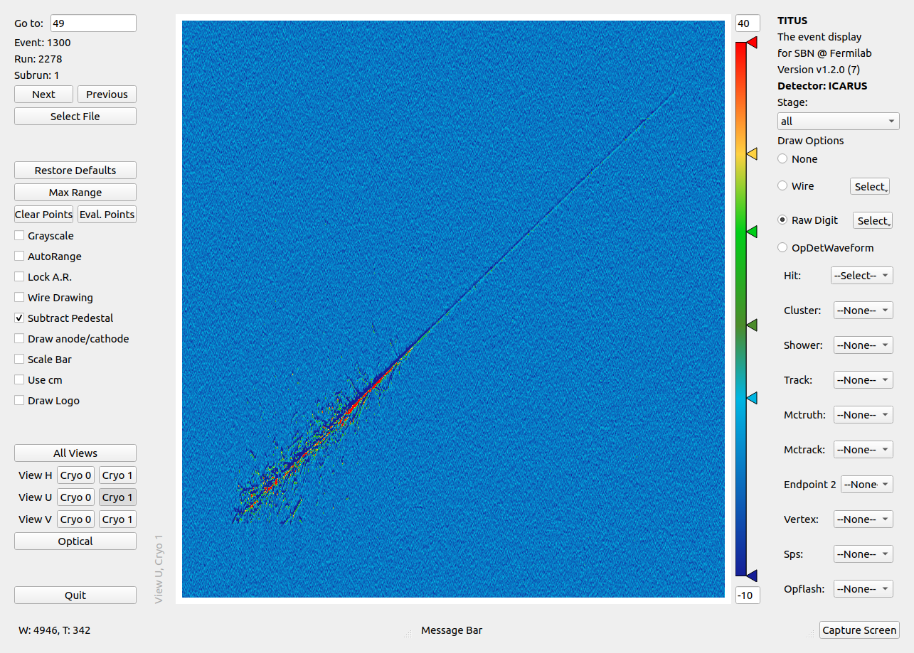

ICARUS Simulation and Reconstruction Code
==========================================

This is version 0 of a wiki age for ICARUS software\
It should have more than a passing familiarity with SBND\...

Developing ICARUS code
-----------------------

-   [The ICARUS Guide to using LArSoft](The_ICARUS_Guide_to_using_LArSoft.html)
-   ICARUS code repository: `icaruscode` (use
    `mrb gitCheckout icaruscode` from your MRB working area)
-   Developing ICARUS code in LArSoft\|More information about developing
    code
-   When a new LArSoft release is available and you want to develop
    against the new LArSoft release
-   Project List
-   [Integration tests](Integration_tests.html)
-   [Introduction to Gallery analysis](https://sbn-docdb.fnal.gov/cgi-bin/private/RetrieveFile?docid=4339&filename=20171023-Petrillo.pdf "by Gianluca"){.external}

