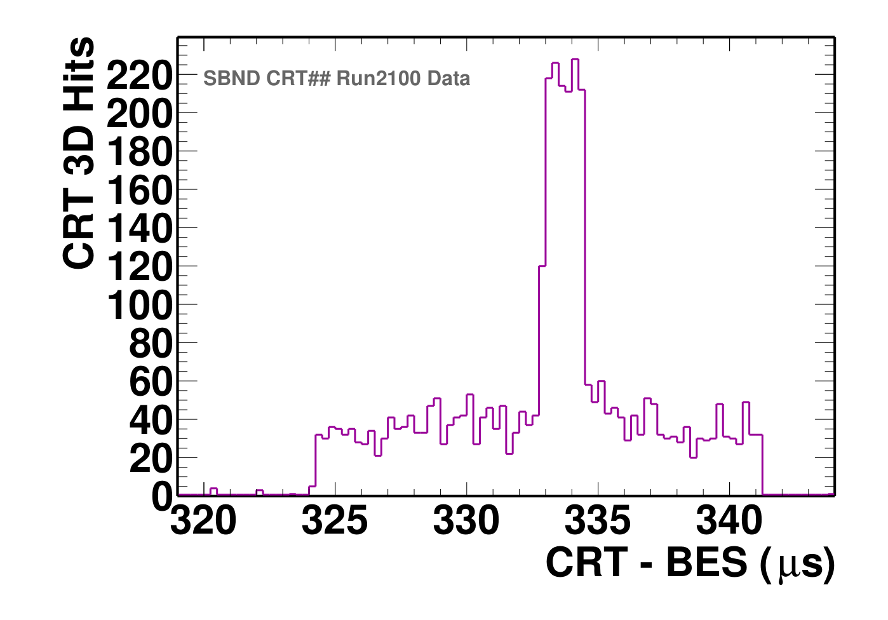
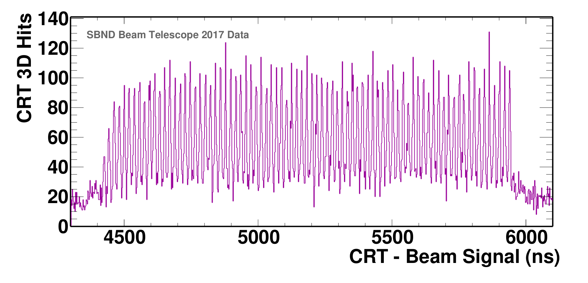
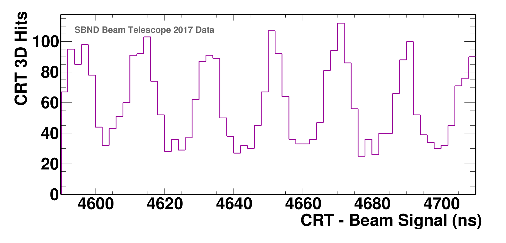
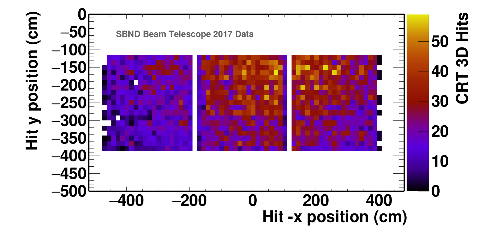

SBND Commissioning - plot repository
========================================================================

CRT sharp sharp plots and images
=================================

1. Beam muon peak June 2022
    - The BES is the “Beam Extraction Signal” that is sent to us from the accelerator complex and arrives roughly 333 microseconds before the beam arrives in the SBN-ND building.  We are currently measuring the time of the CRT hits w.r.t. this reference, we will do something slightly different for physics running.
    - The beam spill duration is 1.6 us.
    - The CRT timing resolution is 1-2 ns per hit after all of the timing corrections due to cable length differences and the light propagation time in the fibers.  We have not made any timing corrections in this plot, this is the raw CRT data.
    - The trigger for this data requires a CRT hit in either the upstream or the downstream sharp (#) during the elongated window around the beam spill
    - Plotted are the hits for the upstream # only
    - This is roughly 12 hours of DAQ uptime  
    - We don’t yet have a number for the absolute rate of beam muons in this transverse area (2m x 2m square centered on the beam axis), but it is on the order of 1 per 1000 spills in the upstream only after subtracting the cosmic background. 
  

2. Beam muon peak June 2022 (with sbndcode reconstruction)
    - The BES is the “Beam Extraction Signal” that is sent to us from the accelerator complex and arrives roughly 333 microseconds before the beam arrives in the SBN-ND building.  We are currently measuring the time of the CRT hits w.r.t. this reference, we will do something slightly different for physics running.
    - The beam spill duration is 1.6 us.
    - This reconstruction DOES include corrections due to cable length differences, time walk and the light propagation time in the fibers.
    - The trigger for this data requires a CRT hit in either the upstream or the downstream sharp (#) during the elongated window around the beam spill
    - Plotted are ALL hits for the upstream # only
    - This is roughly 12 hours of DAQ uptime  
  

CRT Beam Telescope plots and images
===================================

1. Beam Substructure (June - December 2017, with sbndcode reconstruction)
    - The 1.6us beam spill consists of 81 buckets with a period of roughly 19ns.
    - Using a subset of the data collected between June 2017 and January 2019 we can see this structure in the timing of the reconstructed 2D hits.
    - The data was collected using a different standalone DAQ setup.
    - The time of the readouts were measured with respect to a beam signal delayed until after the beam arrivial. A shift was then applied to give the values seen in the plot. 
    - Corrections for cable length and light propagation, time walk and clock drift were applied.

and zoomed in on a few buckets

2. Beam Spot (June - December 2017, with sbndcode reconstruction)
    - Using the upstream set of panels we are able to see the beam's radial intensity decrease or beam spot.
    - The centre of the beam was to the RHS and slightly above the set of panels.
    - Using data from the beam spill window (t1 from 4380ns - 5980ns) and a identical length section from before the beam arrival (t1 from 2000ns - 3600ns) the cosmic background is subtracted from the beam signal region.
    - Note the x axis is inverted in order to reflect the "beam's eye view" entering the building.

